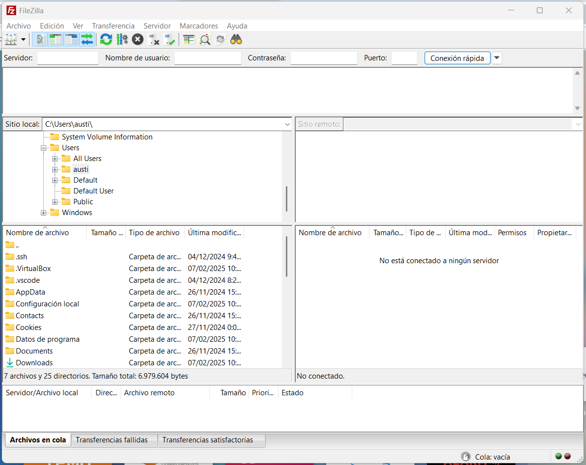
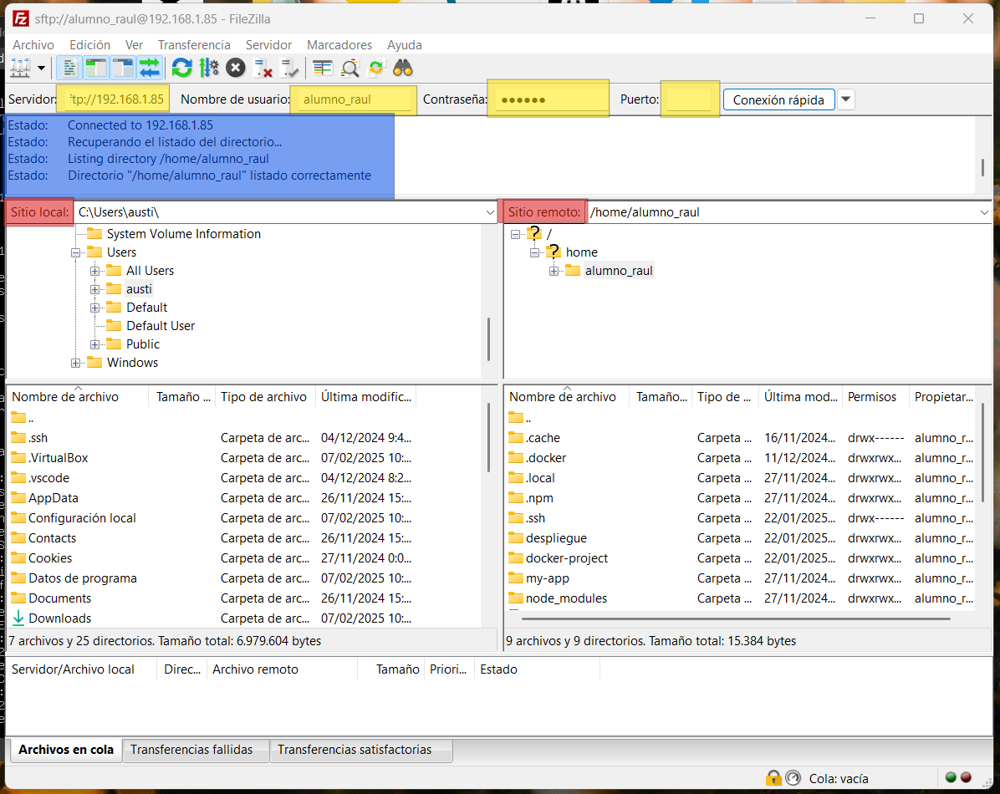

# Configuración de conexión SFTP con FileZilla

## Requisitos previos
- Descargar e instalar **FileZilla Client** desde [https://filezilla-project.org/](https://filezilla-project.org/)
- Tener una máquina virtual configurada como servidor

## Pasos para configurar la conexión

1. **Configurar el adaptador de red de la máquina virtual:**
   - Abrir la configuración de la máquina virtual.
   - Ir a la sección de **Red**.
   - Configurar el adaptador en **Modo puente** (adaptador puente).

2. **Iniciar la máquina virtual del servidor:**
   - Encender la máquina virtual.
   - Iniciar sesión en el servidor.

3. **Obtener la IP del servidor:**
   - Ejecutar el siguiente comando en la terminal del servidor:
     ```bash
     ip a
     ```
   - Anotar la dirección IP asignada.

4. **Conectar con FileZilla:**
   - Abrir **FileZilla Client**.
     
     
   - En la barra superior, ingresar los siguientes datos:
     - **Servidor:** `sftp://<IP_DEL_SERVER>`
     - **Nombre de usuario:** `<USUARIO>`
     - **Contraseña:** `<CONTRASEÑA>`
     - **Puerto:** `21` (Probar también sin puerto)
     - *En mi caso fue sin puerto
   - Clic en **Conexión rápida**.
     

## Notas
- Si la conexión falla, asegurarse de que el servidor tiene el servicio SSH activado.
 ```bash
   systemctl status ssh
   ```
- Asegúrate de que SFTP esté instalado en el servidor.
   ```bash
   sftp -V
   ```
- En algunos casos, el puerto SFTP por defecto es el `22`, probar con ese si es necesario.
